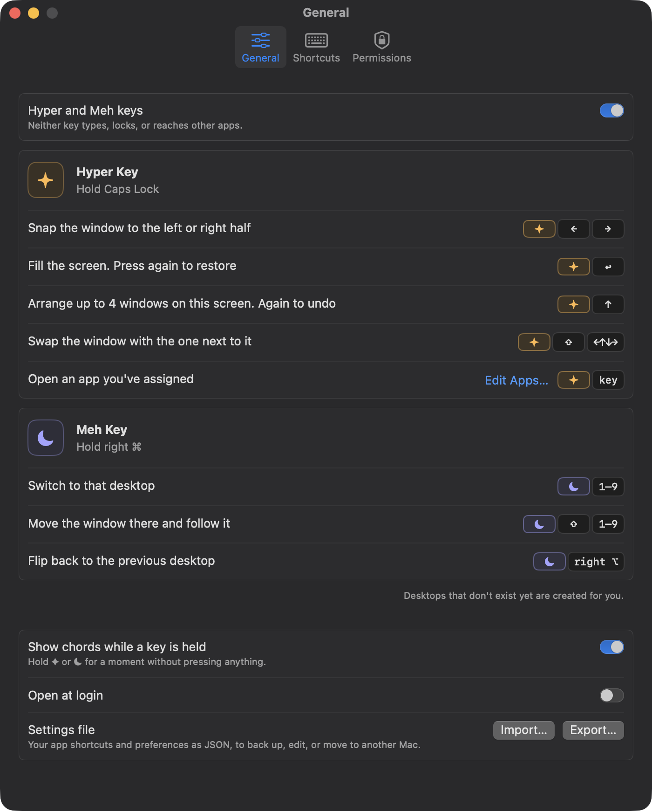
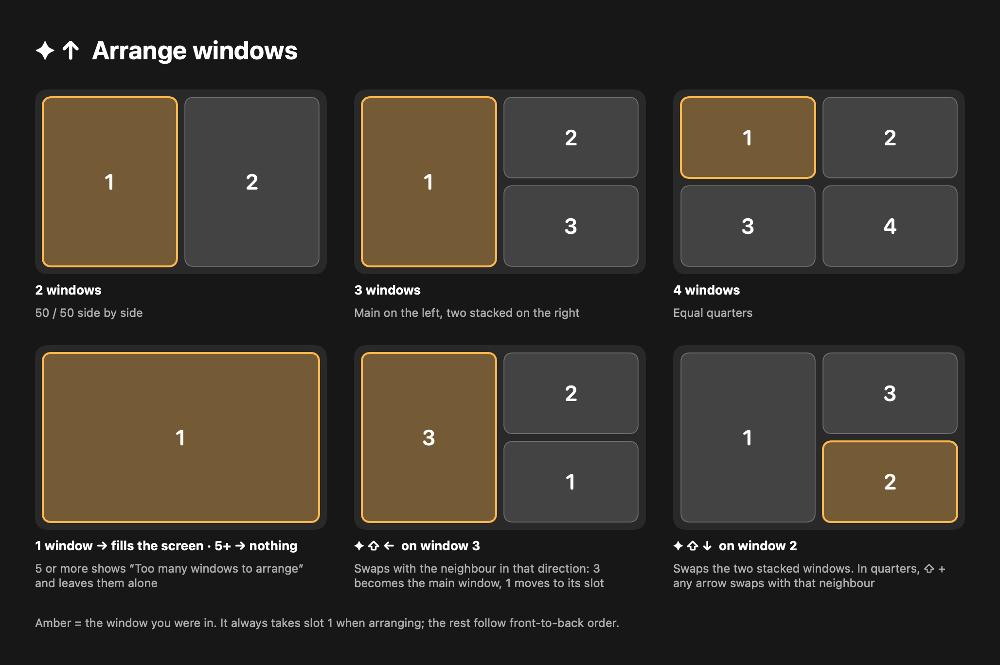
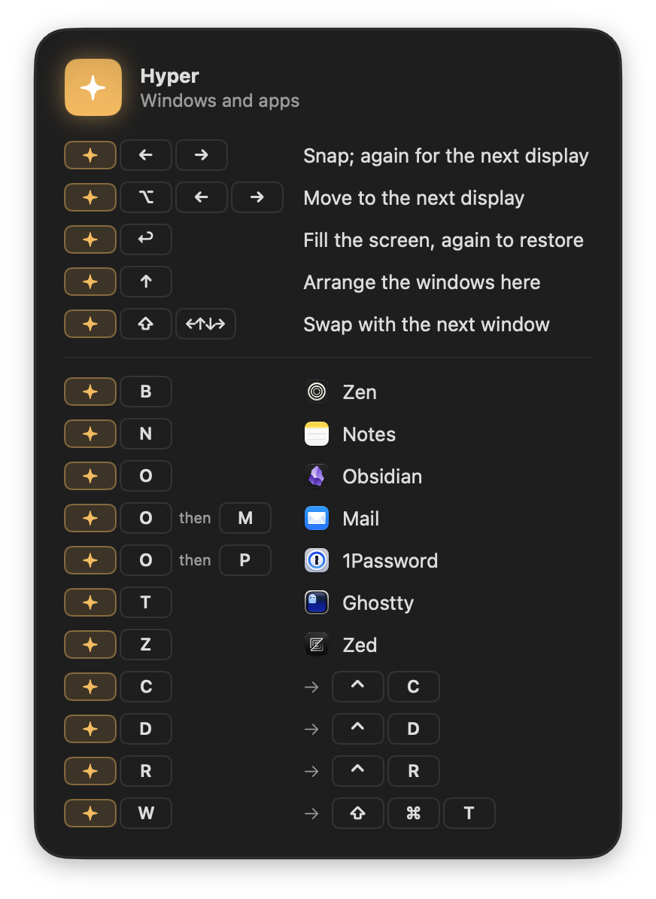
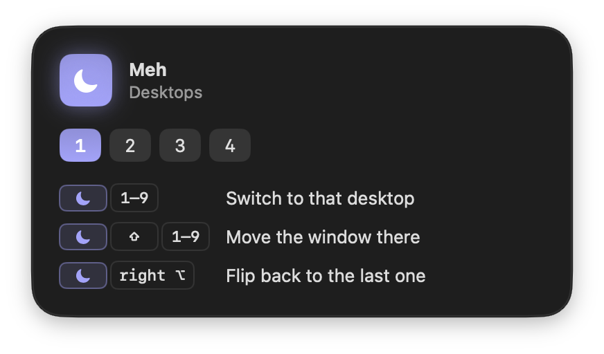
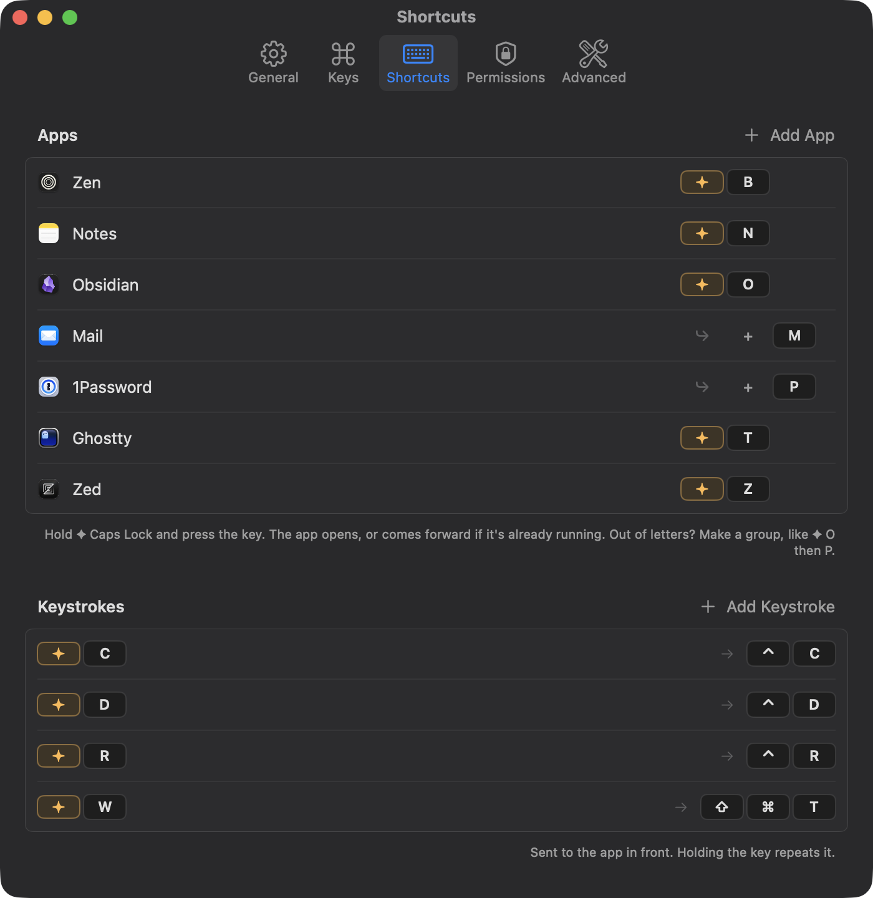

# Superkeys

**Two private keys for your Mac.** Caps Lock becomes ✦ Hyper and right ⌘ becomes ☾ Meh. Hold one and the rest of the keyboard becomes shortcuts for opening apps, arranging windows, and moving between desktops.

[superkeys.space](https://superkeys.space) · macOS 14 or later · native Swift; one dependency, [Sparkle](https://sparkle-project.org), for updates



Neither key types, locks, or reaches other apps, and tapping one on its own does nothing. Every key pressed while one is held is consumed, so a mistyped chord never leaks a character into whatever you're working in. These are Superkeys' own keys, not the classic "Hyper" (⌃⌥⇧⌘) and "Meh" (⌃⌥⇧) combinations that other apps can see.

## What it does

### ✦ Hyper: windows and apps

Hold **Caps Lock**.

| Chord | Action |
| --- | --- |
| ✦ ← / → | Snap the window to the left or right half. Again to move it to the next display |
| ✦ ⌥ ← / → | Move the window to the next display, keeping its size and place |
| ✦ Return | Fill the screen. Press again to restore |
| ✦ ↑ | Arrange the windows on this screen. Press again to undo |
| ✦ ⇧ arrow | Swap the window with the one next to it |
| ✦ any key you choose | Open that app, or bring it forward (✦ B for your browser, ✦ T for your terminal…) |

### ☾ Meh: desktops

Hold **right ⌘**.

| Chord | Action |
| --- | --- |
| ☾ 1–9 | Switch the display under the pointer to that desktop, creating it if it doesn't exist yet |
| ☾ ⇧ 1–9 | Move the window to that desktop and follow it |
| ☾ right ⌥ | Flip back to the previous desktop; again to flip forward |

### Arrange windows

✦ ↑ lays out the windows on the current screen in one go. The window you're in always takes the large or first slot.



- **2 windows** side by side, **3** as one large with two stacked, **4** as quarters. One window fills the screen. With five or more nothing moves, and the menu bar icon shakes and shows how many windows it found.
- **✦ ⇧ arrow** swaps windows around afterwards. ✦ ⇧ ← on a small window promotes it to the large slot.
- It only arranges when you ask. New windows are never tiled automatically, and a window you drag stays where you put it.
- Minimised, hidden, full-screen and fixed-size windows are left out. Apps that can't shrink to a quarter stay pinned to their slot's outer edge instead of running off screen.

### See your chords

Hold ✦ or ☾ for a moment without pressing anything and a panel shows what that key does, including your own app keys and which desktop you're on. It never takes focus and disappears as soon as you let go.

| ✦ Hyper | ☾ Meh |
| --- | --- |
|  |  |

### Your app keys

Any key can open any app. Pick the app, press the key, done.



## Install

With [Homebrew](https://brew.sh):

```bash
brew trust --tap rxmeez/tap
brew install --cask rxmeez/tap/superkeys
```

Superkeys isn't notarised by Apple, so macOS blocks the first launch. Allow it once in **System Settings → Privacy & Security → Superkeys → Open Anyway**, then grant Accessibility when Superkeys asks. [superkeys.space/install](https://superkeys.space/install) walks through it with screenshots. That's the only prompt: after that Superkeys updates itself in the background (Settings → General → Keep Superkeys up to date), and because every release is signed with the same certificate, updates keep both the approval and the Accessibility grant. `brew uninstall --cask superkeys` quits it (which puts Caps Lock and right ⌘ back to normal) and removes it; add `--zap` to delete its settings too.

Or build it yourself:

1. Open `Superkeys.xcodeproj` in Xcode 15 or later.
2. Run the **Superkeys** scheme. The app isn't sandboxed and is signed ad hoc by default.
3. Grant **Accessibility** when asked. Input Monitoring is only needed on the few Macs where the keys still won't start; Superkeys asks for it then.

Superkeys lives in the menu bar. Once set up it starts silently, with no window and no Dock icon; open Settings from the menu bar icon. The icon lights up amber ✦ or indigo ☾ while a key is held.

### Keeping Accessibility across rebuilds

macOS ties the Accessibility grant to the app's signature, and an ad-hoc signature changes on every build. To keep the grant, sign with a stable identity: create `Signing.local.xcconfig` next to `Signing.xcconfig` (it's gitignored) containing

```
CODE_SIGN_IDENTITY = <your signing identity>
ENABLE_DEBUG_DYLIB = NO
```

A self-signed certificate from Keychain Access works. It has no Team ID, which is why Xcode's debug dylib has to be off: the hardened runtime won't load a library whose Team ID differs from the app's. Without a stable identity, run `tccutil reset Accessibility space.superkeys` after rebuilding and grant access again.

## Releasing

Releases are signed with a self-signed "Superkeys" certificate and a Sparkle update key, both kept in the 1Password vault "Superkeys" and read only while a release runs.

- One-time: `scripts/setup_signing_keys.sh` creates both keys, stores them in 1Password, and writes the public update key into `Info.plist`.
- Each release: add a `## [x.y.z]` section to `CHANGELOG.md`, commit, then run `scripts/release.sh x.y.z` (`--dry-run` to build and sign without publishing). It builds a universal app, publishes it and the signed update feed (`site/appcast.xml`) to superkeys.space, tags the release, and bumps the Homebrew cask.
- The Xcode project is generated: edit `scripts/generate_project.py`, not the `.pbxproj`.
- Debug builds are "Superkeys Dev" (`space.superkeys.dev`) with their own Accessibility entry and preferences, so they never get mixed up with an installed release. Quit one before running the other: both remap the same keys.

## Settings file

Settings → General → **Export…** saves your app keys and preferences as JSON, to back up, edit, or move to another Mac. **Import…** shows what it will replace, and anything it had to skip, before changing anything.

```json
{
  "version": 1,
  "showChordsWhileHeld": true,
  "apps": [
    { "key": "B", "keyCode": 11, "bundleID": "app.zen-browser.zen", "name": "Zen" }
  ]
}
```

When editing by hand, `keyCode` and `name` are optional: give `key` as a letter, digit, punctuation mark, or a name such as `F5`, `Space`, or `Tab`. Arrow keys and Return can't be assigned because ✦ uses them for windows.

## Privacy

Superkeys never records or stores what you type. Keys pass straight through unless ✦ or ☾ is held, and nothing leaves your Mac: no analytics, no accounts, no network access.

## How it works

- **The keys.** While on, Superkeys adds two entries to the system `UserKeyMapping`: Caps Lock → F18 and right ⌘ → F19. They become plain keys with a clean press and release that no app treats as a modifier. A session event tap watches for them and consumes everything typed while one is held. Your own `hidutil` remaps are kept and put back when Superkeys pauses or quits, and leftovers from a force-quit are cleaned up on the next start. Left ⌘ is untouched.
- **Windows** move through the Accessibility API. Snapping takes 20–50 ms.
- **Desktops** are read through private SkyLight calls but switched with the system's own "Switch to Desktop n" shortcuts, which Superkeys turns on for Desktop 1–9. `CGSManagedDisplaySetCurrentSpace` only updates bookkeeping and leaves the screen where it was, so it isn't used.
- **Moving a window to another desktop.** macOS ignores the private move calls from other processes, so Superkeys holds the window by its title bar and lets the system carry it through its own desktop switch, then puts it back exactly where it was. It takes about half a second.
- **New desktops** are made by opening Mission Control and pressing its add button through the accessibility tree (`mc.spaces.add` in WindowManager). Mission Control flashes on screen for about half a second; Reduce Motion softens it.
- **Idle cost** is zero: no timers or polling while the keys are on, only the event tap.

## Limitations

- With several displays each has its own desktops (macOS's "Displays have separate Spaces"): ☾ acts on the display under the pointer. How macOS numbers its Switch to Desktop shortcuts across displays is set by `defaults write space.superkeys desktopNumbering global|perDisplay`.
- Desktop 10 has no system shortcut, so ☾ 0 does nothing.
- The chord panel uses Liquid Glass on macOS 26 and later, and a blur before that.

## Website

The landing page for [superkeys.space](https://superkeys.space) lives in `site/`: one static HTML page with no build step. Open `site/index.html` in a browser to preview it; deploy the `site/` folder to any static host.

## Roadmap

Ideas, trade-offs, and what macOS does and doesn't allow are tracked in [FEATURES.md](FEATURES.md).

## License

Not yet open source. A license will be added when the project is published.
